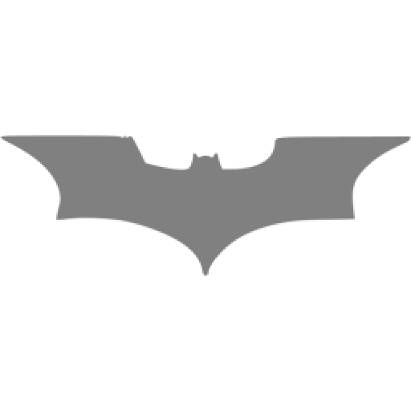

<article id="post-2" class="post-2 page type-page status-publish has-post-thumbnail" itemtype="https://schema.org/CreativeWork" itemscope="">
  

    <header class="entry-header">
      <h1 class="entry-title" itemprop="headline">Cyber blog</h1>
    </header>
    

      
Este es un espacio personal en el que quiero compartir diferentes hallazgos y temas que me apasionan, entre ellos la seguridad informática :)

      
Habrán algunos CVEs ;)

      <h4 class="wp-block-heading">Hall of Fame</h4>
      <ul class="wp-block-list">
        <li><a rel="noreferrer noopener" href="https://cpanel.net/cpanel-security-hall-of-fame/" data-type="URL" data-id="https://cpanel.net/cpanel-security-hall-of-fame/" target="_blank">Hall of Fame</a> 2021 en <strong>CPanel</strong></li>
        <li><a href="https://es.siteground.com/viewtos/responsible_disclosure_policy?scid=&amp;lang=es_ES" target="_blank" rel="noreferrer noopener">Hall of Fame </a>2023 en <strong>SiteGround</strong></li>
        <li><a rel="noreferrer noopener" href="https://hackerone.com/leaderboard/country?year=2022&amp;country=CO" target="_blank">Top 3 en Country Ranking</a> 2022 en <strong>HackerOne</strong></li>
        <li><a href="https://www.wordfence.com/threat-intel/vulnerabilities/researchers/felipe-restrepo-rodriguez">WordFence Acknowledgment </a></li>
      </ul>
      <h4 class="wp-block-heading" id="hallazgos">Hallazgos</h4>
      <ul class="wp-block-list">
        <li>Reportado y resuelto XSS en <strong>NASA</strong></li>
        <li><a rel="noreferrer noopener" href="https://www.ibm.com/support/pages/security-bulletin-ibm-workload-scheduler-vulnerable-cve-2019-4608-and-cve-2020-5028" target="_blank"><em>CVE</em>-2019-4608</a> y <a rel="noreferrer noopener" href="https://www.ibm.com/support/pages/security-bulletin-ibm-workload-scheduler-vulnerable-cve-2019-4608-and-cve-2020-5028" target="_blank"><em>CVE</em>-2020-5028</a> XSS en <strong>IBM Tivoli</strong></li>
        <li><a rel="noreferrer noopener" href="https://support.broadcom.com/security-advisory/content/security-advisories/CA20201215-01-Security-Notice-for-CA-Service-Catalog/ESDSA16810" target="_blank"><em>CVE</em>-2020-29478</a> DoS en <strong>CA Service Catalog</strong> de <strong>Broadcom</strong></li>
        <li><a rel="noreferrer noopener" href="https://wpscan.com/vulnerability/9b3c5412-8699-49e8-b60c-20d2085857fb" target="_blank"><em>CVE</em>-2021-24210</a> Open Redirect en <strong>PhastPress </strong>de <strong>WordPress</strong></li>
        <li><a rel="noreferrer noopener" href="https://wpscan.com/vulnerability/17287d8a-ba27-42dc-9370-a931ef404995" target="_blank"><em>CVE</em>-2021-24526</a> XSS en <strong>Form Maker </strong>de <strong>WordPress</strong></li>
        <li><a rel="noreferrer noopener" href="https://wpscan.com/vulnerability/a1dc0ea9-51dd-43c3-bfd9-c5106193aeb6" data-type="URL" data-id="https://wpscan.com/vulnerability/a1dc0ea9-51dd-43c3-bfd9-c5106193aeb6" target="_blank"><em>CVE</em>-2021-24513</a> XSS en <strong>Form Builder </strong>de <strong>WordPress</strong></li>
        <li><a rel="noreferrer noopener" href="https://wpscan.com/vulnerability/88d70e35-4c22-4bc7-b1a5-24068d55257c" target="_blank">CVE-2021-24516</a> XSS en <strong>PlanSo Forms </strong>de <strong>WordPress</strong></li>
        <li><a rel="noreferrer noopener" href="https://wpscan.com/vulnerability/0afa78d3-2403-4e0c-8f16-5b7874b03cd2" target="_blank"><em>CVE</em>-2021-24514</a> XSS en <strong>Visual Form Builder </strong>de <strong>WordPress</strong></li>
        <li><a href="https://wpscan.com/vulnerability/2ae5c375-a6a0-4c0b-a9ef-e4d2a28bce5e" data-type="URL" data-id="https://wpscan.com/vulnerability/2ae5c375-a6a0-4c0b-a9ef-e4d2a28bce5e" target="_blank" rel="noreferrer noopener"><em>CVE</em>-2022-4774</a> RCE via Unauthenticated Arbitrary File Upload en <strong>Bit Form</strong> de <strong>WordPress</strong></li>
        <li><a rel="noreferrer noopener" href="https://wpscan.com/vulnerability/a6bfc150-8e3f-4b2d-a6e1-09406af41dd4" target="_blank"><em>CVE</em>-2022-0989</a> Abuso de funcionalidad en <strong>NS WooCommerce Watermark </strong>de <strong>WordPress</strong></li>
        <li><a rel="noreferrer noopener" href="https://wpscan.com/vulnerability/1697351b-c201-4e85-891e-94fdccbdfb55" target="_blank"><em>CVE</em>-2022-23987</a> XSS en <strong>WS Form Lite</strong> de <strong>WordPress</strong></li>
        <li><a rel="noreferrer noopener" href="https://wpscan.com/vulnerability/9d5738f9-9a2e-4878-8a03-745894420bf6" target="_blank"><em>CVE</em>-2022-23988</a> XSS en <strong>WS Form Lite </strong>de <strong>WordPress</strong></li>
        <li><a rel="noreferrer noopener" href="https://wpscan.com/vulnerability/c933460b-f77d-4986-9f5a-32d9f3f8b412" target="_blank"><em>CVE</em>-2023-0428</a> XSS en <strong>Watu Quiz</strong> de <strong>WordPress</strong></li>
        <li><a rel="noreferrer noopener" href="https://wpscan.com/vulnerability/67d84549-d368-4504-9fa9-b1fce63cb967" target="_blank"><em>CVE</em>-2023-0429</a> XSS en <strong>Watu Quiz</strong> de <strong>WordPress</strong></li>
        <li><a rel="noreferrer noopener" href="https://cve.mitre.org/cgi-bin/cvename.cgi?name=CVE-2023-0548" target="_blank"><em>CVE</em>-2023-0548</a> XSS en <strong>Namaste! LMS</strong> de <strong>WordPress</strong></li>
        <li><em><a href="http://CVE-2023-0545https://wpscan.com/vulnerability/b604afc8-61d0-4e98-8950-f3d29f9e9ee1" target="_blank" rel="noreferrer noopener">CVE-2023-2254</a></em> XSS en <strong>Ko-fi Button </strong>de<strong> WordPress</strong></li>
        <li><a rel="noreferrer noopener" href="https://cve.mitre.org/cgi-bin/cvename.cgi?name=CVE-2023-0545" target="_blank"><em>CVE</em>-2023-0545</a> XSS en <strong>Hostel</strong> de <strong>WordPress</strong></li>
        <li><a href="https://wpscan.com/vulnerability/7ee1efb1-9969-40b2-8ab2-ea427091bbd8" target="_blank" rel="noreferrer noopener"><em>CVE</em>-2023-2580</a> XSS en <strong>AI-Engine</strong> de <strong>WordPress</strong></li>
        <li><a href="https://wpscan.com/vulnerability/4dad1c0d-bcf9-4486-bd8e-387ac8e6c892" target="_blank" rel="noreferrer noopener"><em>CVE</em>-2023-2578</a> XSS en <strong>Buy Me a Coffee</strong> de <strong>WordPress</strong></li>
      </ul>
      <h5 class="wp-block-heading">Hallazgos en colaboración con Agustin Tedone, Luciano Sorrentino, Fabrizio Faggiani y Robinson</h5>
      <ul class="wp-block-list">
        <li><a href="https://github.com/n8n-io/n8n/security/advisories/GHSA-pr9r-gxgp-9rm8" target="_blank" rel="noreferrer noopener"><em>CVE</em>-2025-49595</a> Denial of Service via Malformed Binary Data Requests en <strong>N8N</strong></li></ul>
      <ul class="wp-block-list">
        <li><a href="https://github.com/advisories/GHSA-gq57-v332-7666" target="_blank" rel="noreferrer noopener"><em>CVE</em>-2025-52554</a> Broken Access Control en <strong>N8N</strong></li></ul>
      <ul class="wp-block-list">
        <li><a href="https://github.com/advisories/GHSA-hfmv-hhh3-43f2" target="_blank" rel="noreferrer noopener"><em>CVE</em>-2025-52478</a> Stored XSS in n8n Form Trigger allows Account Takeover en <strong>N8N</strong></li></ul>
      <ul class="wp-block-list">
        <li><a href="https://github.com/n8n-io/n8n/security/advisories/GHSA-mvh4-2cm2-6hpg" target="_blank" rel="noreferrer noopener"><em>CVE</em>-2025-58177</a> Stored XSS in n8n LangChain Chat Trigger Node en <strong>N8N</strong></li>
      </ul>
      <h5 class="wp-block-heading">Hallazgos en colaboración con Joaquin Pochat y Gabriel Calle</h5>
      <ul class="wp-block-list">
        <li><a rel="noreferrer noopener" href="https://cve.mitre.org/cgi-bin/cvename.cgi?name=CVE-2023-0543" target="_blank"><em>CVE</em>-2023-0543</a> XSS en <strong>Arigato Autoresponder and Newsletter </strong>de <strong>WordPress</strong></li>
      </ul>
      <h5 class="wp-block-heading has-medium-font-size" id="hallazgos-en-colaboracion-con-juan-cruz">Hallazgos en colaboración con <a rel="noreferrer noopener" href="https://juansec.github.io/" target="_blank">Juan Cruz</a></h5>
      <ul class="wp-block-list">
        <li><a href="https://wpscan.com/vulnerability/702a4283-1fd6-4186-9db7-6ad387d714ea" target="_blank" rel="noreferrer noopener"><em>CVE</em>-2021-24744 </a>XSS en <strong>Contact Forms by Cimatti </strong>en &nbsp;<strong>WordPress</strong></li>
      </ul>
      <h5 class="wp-block-heading has-medium-font-size">Hallazgos en colaboración con Daniel Alvear, Germán Novoa, Gabriel Vásquez, Anderson Reis</h5>
      <ul class="wp-block-list">
        <li><a href="https://wpscan.com/vulnerability/753df046-9fd7-4d15-9114-45cde6d6539b/"><em>CVE</em>-2023-6037</a> XSS en WP TripAdvisor Review Slider</li>
      </ul>
      
Hallazgos en progreso

      <ul class="wp-block-list">
        <li><em>CVE</em>-2020-26631 Reserved</li>
      </ul>
      
Hasta el momento es lo que tengo, apenas estoy puliendo el blog :P

      
Espero que se diviertan :)

      
Otra info de interés:

      <ul class="wp-block-list">
        <li><a rel="noreferrer noopener" href="https://www.youtube.com/playlist?list=PLG8BBKeuZziuQKE_xHtQbinoGzjOrALCY" target="_blank">Canal de YouTube</a></li>
        <li><a rel="noreferrer noopener" href="https://hackerone.com/pfelilpe" target="_blank">HackerOne Profile</a></li>
        <li><a href="https://www.linkedin.com/in/felipe-restrepo-rodriguez/" target="_blank" rel="noreferrer noopener">LinkedIn Profile</a></li>
      </ul>
      

         
         
        Happy Hacking
         
        
If you found this project helpful or interesting, consider buying me a coffee to support my work: ☕️

      

    

  

</article>
